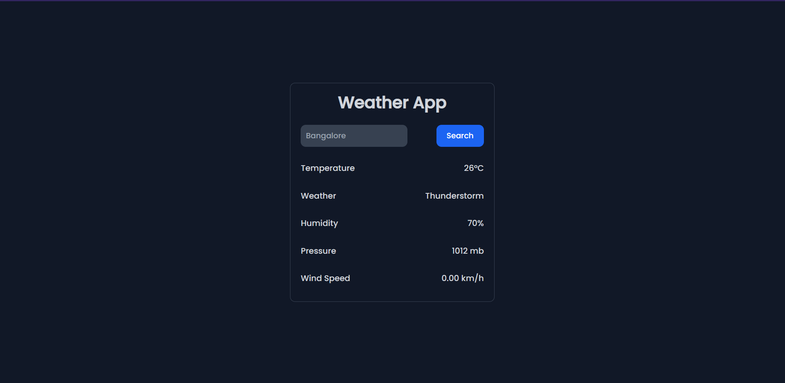
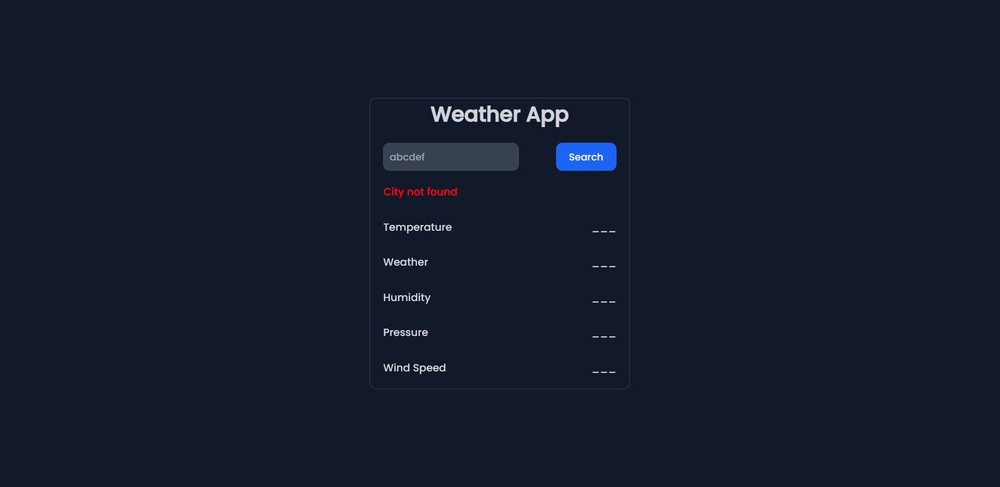

<h1 align="center">Weather-App</h1>

A very simple Weather App built with HTML, CSS, Vanilla Javascript and OpenWeatherMap Api.

### OpenWeatherMap API
[_OpenWeatherMap API_](https://openweathermap.org/api) is an easy-to-use, fast and free weather API from [OpenWeatherMap](https://openweathermap.org/). It provides current weather data for any location including over 200,000 cities.

## [Screenshots](/Screenshots/)
Take a look at few screenshots of this project.
<br>




## To-Do Tasks 
- [ ] Light/Dark Theme
- [ ] Dynamic Image according to weather (like a bright sun for clear, raining clouds for rains)
- [ ] Image/Logo for each Weather Parameters
- [ ] Will be adding more

## [Contributions](CONTRIBUTIONS.md)🚀
This is an open sourced project and contributions are most welcome.
Please follow the steps to start contributing to this project.
* Fork the repository.
* Clone the fork to your local machine and add upstream remote:
    ``` 
    git clone https://github.com/<YOUR USERNAME>/Weather-App.git
    cd Weather-App/
    git remote add upstream https://github.com/Suvradippaul/Weather-App.git
    ``` 
* Synchronize your local master branch with upstream:
    ```
    git checkout master
    git pull upstream master
    ```
* Create a new branch:
    ```
    git checkout -b test-branch
    ```
* Make changes and commit
   ```
   git add .
   git commit -m "A COMMIT MESSAGE RELATED TO YOUR CONTRIBUTION"
   ```
* Push to YOUR Fork:
  ``` 
  git push -u upstream test-branch
  ```
* Go to the [repository](https://github.com/Suvradippaul/Weather-App) and make a Pull Request.

## [License](LICENSE.md)
This project is licensed under the terms of the [MIT license](LICENSE.md).
